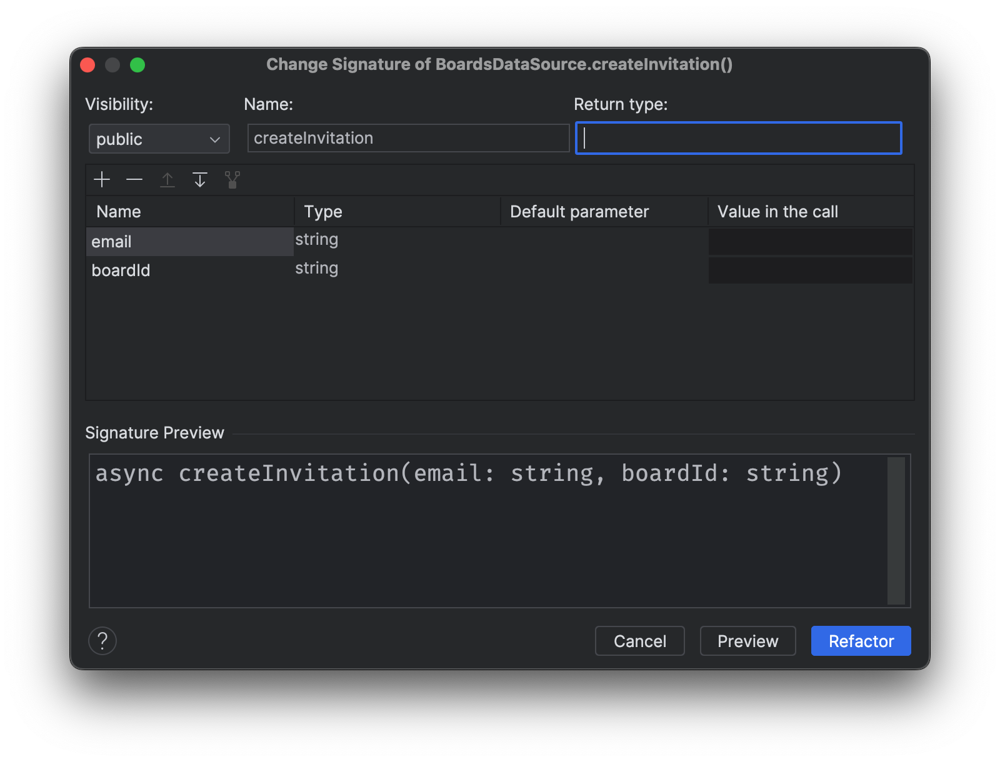
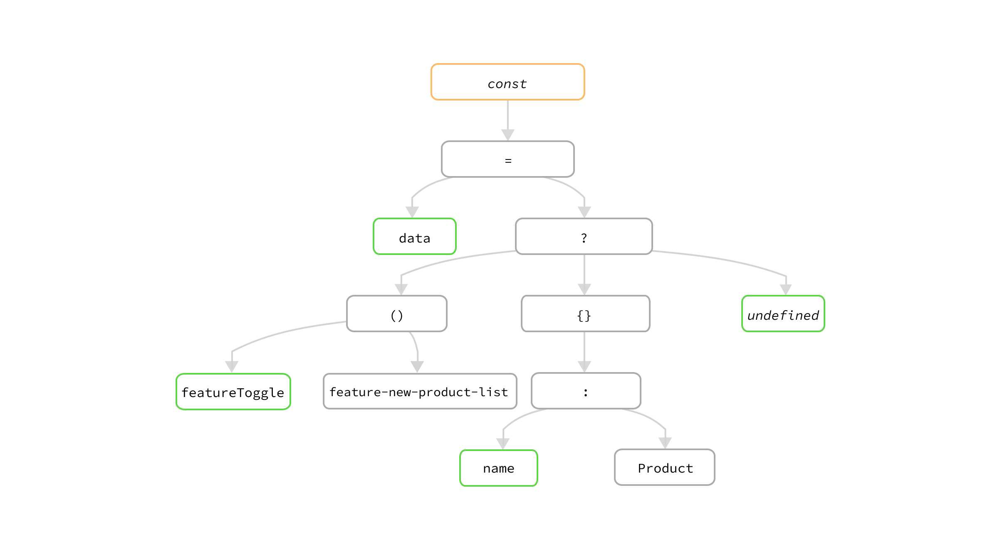

# Refactoring with Codemods to Automate API Changes

*Codemods are powerful tools that allow developers to automate code refactoring, particularly when handling breaking changes to APIs. By parsing code into an Abstract Syntax Tree (AST) and applying transformations, codemods enable precise, large-scale changes with minimal manual effort. This article delves into how codemods can help library developers manage breaking API changes, improve code hygiene, and reduce technical debt in large or distributed codebases. We’ll walk through practical examples, from simple feature toggle removals to complex React component refactorings, and discuss potential downsides of using codemods along with complementary techniques to mitigate these challenges.*

## Introduction

Imagine you’re a library developer, and you’ve created a brilliant utility that hundreds of thousands of other developers use every day (thinking of *lodash* or *React*). It works perfectly, and people love it. However, as is often the case, some usages have emerged that are beyond your original design. Now, you need to extend one of your APIs by adding another parameter or changing the existing signature to fix certain edge cases. But, with so many users relying on your library, how can you roll out these breaking changes without causing headaches?

This is where **codemods** come in—a powerful tool for automating large-scale code transformations, allowing developers to introduce breaking API changes, refactor legacy codebases, and maintain code hygiene with minimal manual effort.

In this article, we’ll explore what codemods are and the tools you can use to create them, such as **jscodeshift**, [**hypermod.io**](http://hypermod.iohttps://www.hypermod.io/), and [codemod.com](http://codemod.com/). We’ll walk through real-world examples, from cleaning up feature toggles to refactoring component hierarchies. You’ll also learn how to break down complex transformations into smaller, testable pieces—a practice known as codemod composition—to ensure flexibility and maintainability. 

By the end, you’ll see how codemods can become a vital part of your toolkit for managing large-scale codebases, helping you keep your code clean and maintainable while handling even the most challenging refactoring tasks.

### Breaking Changes in APIs

Returning to the scenario of the library developer, after the initial release, new usage patterns begin to emerge, prompting the need to extend an API—perhaps by adding a parameter or modifying a function signature to make it easy to use.

For simple changes, a basic find-and-replace in the IDE could work. In more complex cases, you might resort to using tools like `sed` or `awk`. However, when your library is widely adopted, the scope of such a change becomes harder to manage. You can’t be sure how extensively the modification will impact your users, and the last thing you want is to break existing functionality that doesn’t require an update.

A common approach is to announce the breaking change, release a new version, and ask users to migrate at their own pace. But this workflow, while familiar, isn't ideal. It often doesn't scale well, especially for major shifts. Consider React’s transition from class components to function components with hooks—a paradigm shift that took years for large codebases to fully adopt. By the time teams managed to migrate, more breaking changes were often already on the horizon.

For library developers, this situation creates a burden. Maintaining multiple older versions to support users who haven’t migrated is both costly and time-consuming. For users, frequent changes risk eroding trust. They may hesitate to upgrade or start exploring more stable alternatives, perpetuating the cycle.

But what if you could help users manage these changes automatically? What if you could release a tool alongside your update that refactors their code for them—renaming functions, updating parameters order, and removing unused code without requiring manual intervention?

That’s where **codemods** come in. Several libraries, including React and Next.js, have already embraced codemods to smooth the path of version bumps. For example, React provides codemods to handle the migration from older API patterns, like the old Context API, to newer ones.

So, what exactly is the codemod we’re talking about here?

### What is a Codemod?

A **codemod** (code modification) is an automated script that transforms code to adhere to new APIs, syntax, or coding standards. Codemods leverage Abstract Syntax Tree (AST) manipulation to apply precise, large-scale changes consistently across codebases. It is originated at Facebook, initially developed to help their engineers manage large-scale refactoring tasks across vast codebases like React and other internal products. As the company scaled, keeping the codebase up to date with new APIs and coding patterns became challenging. 

Manually updating thousands of files across different repositories was inefficient and error-prone, so the concept of codemods—automated scripts that transform code—was introduced to tackle this problem.

The process typically involves three main steps:

1. **Parsing** the code into an AST, where each part of the code is represented as a tree structure.
2. **Modifying** the tree by applying a transformation, such as renaming a function or changing parameters.
3. **Rewriting** the modified tree back into the source code.

By using this approach, codemods ensure that changes are applied consistently across every file in a codebase, reducing the chance of human error. Codemods can also handle complex refactoring scenarios, such as changes to deeply nested structures or removing deprecated API usage.

If we visualise the process a bit, it would be something like this:


The idea of such a program that can “understand” your code and then do some automatic transformation isn’t new. Actually, that’s how your IDE works when you hit a keyboard shortcut to run refactorings like Extract Function, Rename Variable, or Inline Function, etc.

Essentially, IDE parses the source code in your project under the hood into ASTs, and when you press a keyboard shortcut while editing a file, it applies the predefined transformations into the tree to make corresponding changes, and then saves the result to files. 

Of course, for modern IDEs, there are many things to figure out to make sure it happens correctly and efficiently. Like figuring out the scope of the change you’re likely to apply, how to resolve the collision the change introduces (like when you rename a variable to a name that has already defined in scope), etc. 

IDE might provide a few options so you can define how a refactoring would run, in other words, you need to pass in a few parameters for some refactorings - for example, when Change Signature, you will be prompted to a dialogue to adjust the order of parameters, default values, and return values before it can change it.



Change Signature Refactoring in IDE WebStorm

As in this article, we’ll focus on the JavaScript (as well as JSX) code, so the tools described here are all related to the language. But the idea isn’t limited only to one particular programming language, we’ll have a brief discussion on that in the later section (about how to make similar changes in Java).

## Use jscodeshift in JavaScript codebases

Let’s have a look at a concrete example to get a taste of how we could run a codemod in JavaScript program. The JavaScript community has already got several tools to make the work feasible, there are parsers to parse the source code to AST, as well as transpilers that can transform the tree to other format (that’s why you can use TypeScript in the first place), as well as tools that can help you to apply codemods to other repositories automatically.

One of the most popular tools for writing codemods is **jscodeshift**, a toolkit maintained by Facebook. It simplifies the creation of codemods by providing a powerful API to manipulate ASTs. With jscodeshift, developers can search for specific patterns in the code and apply transformations at scale.

You can use `jscodeshift` to identify and replace deprecated API calls with updated versions across an entire project.

Let’s have a look at how can we compose a codemod manually and then understand a typical workflow first.

### Clean A Stale Feature Toggle

Let’s start with a simple yet practical example to demonstrate the power of codemods. Imagine you’re using a [feature toggle](https://martinfowler.com/articles/feature-toggles.html) in your codebase to control the release of unfinished or experimental features. After the feature is live in production and working as expected, the next logical step is to clean up the toggle and any related logic.

For instance, consider the following code:

```tsx
const data = featureToggle('feature-x') ? {name: 'Feature X'} : undefined;
```

Once the feature is fully released and no longer needs a toggle, this can be simplified to:

```tsx
const data = { name: 'Feature X' };
```

The task involves finding all instances of `featureToggle` in the codebase, checking whether the toggle refers to `feature-x`, and then removing the conditional logic surrounding it. At the same time, we need to ensure that other feature toggles (like `feature-y`, which may still be in development) remain untouched. This means the codemod needs to *understand* the structure of the code to apply changes selectively.

### Understanding the AST

Before we dive into writing the codemod, let’s break down how this specific code snippet looks in an AST.  You can use tools like [astexplorer](https://astexplorer.net/) to check how the source code and AST are mapped. It’s useful to understand what type of node you’re interacting with before apply any changes.

The image below shows the syntax tree in terms of ECMA syntax, it has nodes like `Identifier` like variables, and `StringLiteral` like the toggle name, and also the more abstracted nodes like `CallExpression` and `ConditionExpression` :


We could also look at it with the actual value of the expression so you can understand how the code is parsed and represented as the tree above.



In this AST representation, the variable `data` is assigned using a **ConditionalExpression**. The **test** part of the expression calls `featureToggle('feature-x')`. If the test returns `true`, the **consequent** branch assigns `{name: 'Feature X'}` to `data`. If `false`, the **alternate** branch assigns `undefined` instead.

For a task that has clear input and output definition, I prefer to write test first and then implement it, and then add a few more specific variations (like use `featureToggle` call inside a if statement), and then extend it until it covers all the possible cases. A side note is that It’s a good scenario to apply Test-Driven Development, even you’re not actively use the method in coding, as you know exactly what the ins and outs are before you code, and also later on when you twicle your codemods, it’s much safer and easier.

It’s pretty easy to do it with jscodeshfit as it has a few utilities that help us to write tests to verify how a codemod should behalf:

```tsx
const transform = require("../remove-feature-toggle-x");

defineInlineTest(
  transform,
  {},
  `
  const data = featureToggle('feature-x') ? {name: 'Feature X'} : undefined;
  `,
  `
  const data = {name: 'Feature X'};
  `,
  "delete the surrounding conditional operator"
);
```

The `defineInlineTest` here is from jscodeshift library, and you can basically define the input and expected output, as well as a string to describe the intent of the test. There are a few other options (like the parser when transforming the tree) but we’ll skip them for now. And now if we run the test with a normal `jest` command, it fails as we don’t have any code written yet.

### Writing the Codemod

First, let’s define a *transform* function. The simplest way to do it is to create a file `transform.js` with the following code structure:

```tsx
module.exports = function(fileInfo, api, options) {
  const j = api.jscodeshift;
  const root = j(fileInfo.source);

  // manipulate the tree nodes here
  
  return root.toSource();
};
```

It reads file into a tree and then allows us to use jscodeshift tree API to query, add or modify the tree nodes. In the end, we can call `.toSource` to output the tree back to source code.

With the structure above in place, we now can start to implement the transform steps:

1. Finds all instances of `featureToggle`.
2. Verifies that the argument passed is `'feature-x'`.
3. Replaces the entire conditional expression with the **consequent** part, effectively removing the toggle.

Here’s how we can achieve this using `jscodeshift`:

```tsx
module.exports = function (fileInfo, api, options) {
  const j = api.jscodeshift;
  const root = j(fileInfo.source);

  // Find ConditionalExpression where the test is featureToggle('feature-x')
  root
    .find(j.ConditionalExpression, {
      test: {
        callee: { name: "featureToggle" },
        arguments: [{ value: "feature-x" }],
      },
    })
    .forEach((path) => {
      // Replace the ConditionalExpression with the 'consequent'
      j(path).replaceWith(path.node.consequent);
    });

  return root.toSource();
};
```

The codemod above

- looks for `ConditionalExpression` nodes where the test calls `featureToggle('feature-x')`.
- when found, it replaces the entire conditional expression with the **consequent** (in this case, `{ name: 'Feature X' }`), effectively removing the toggle logic and leaving the clean, simplified code behind.

The example above gives you a clear idea of what a codemod looks like and how easily you can create a useful transformation that can be applied to a large codebase, significantly reducing manual effort.

We will need to write a few more test cases to make sure it covers the `if-else` statement, handle the logical expression like `!featureToggle('feature-x')` and so on, to make the codemod is robust enough in the real-world scenarios.

And once we have the codemod ready, we could then test it out by a target codebase, usually the one we’re working on. jscodeshift provides a command line tool you can use, pass in the transform file name as the `transform-name` and the files to be transformed, it will try to apply the codemod and report what the results are.

```java
$ jscodeshift -t transform-name src/
```

Once you’re happy with the results, one good indicator would be all the functional tests are still passing, and you don’t have anything break (even you’re making a breaking change), and you can commit the changes just like normal workflow, raise the pull request and eventually merge it.

To summarise here, the typical workflow of how you would write a codemod to transform code from one form to another is: 

- Firstly you will need to know the inputs and outputs of the change, write a valid case to verify the transformation
- Then you need to understand the tree structure of the code you’re changing
- Then you write a query to find these nodes on the tree
- Once you have these nodes and then you use jscodeshift API to modify them
- Then you run the jscodeshift command line tool to a target codebase to verify the results

### Codemods Improve Code Quality and Maintainability

Codemods aren’t just useful for managing breaking API changes—they can significantly improve code quality and maintainability. As codebases evolve, they often accumulate technical debt, including outdated feature toggles, deprecated methods, or tightly coupled components. Manually refactoring these pieces of code can be time-consuming and error-prone.

By automating such refactoring tasks, codemods ensure that your codebase remains clean and free of legacy patterns. Regularly applying codemods allows you to enforce new coding standards, remove unused code, and modernize your codebase without having to touch every file manually.

### Refactoring an Avatar Component

Let’s consider a more complex case. Suppose you’re working with a design system that includes an `Avatar` component. This component is tightly coupled to a `Tooltip`. Whenever a user passes a `name` prop into `Avatar`, it automatically wraps the avatar with a tooltip. 


This coupling can limit flexibility and force developers to include unnecessary `Tooltip` dependencies even when they don't want to use them.

Here’s the existing `Avatar` implementation:

```tsx
import { Tooltip } from "@design-system/tooltip";

const Avatar = ({ name, image }: AvatarProps) => {
  if (name) {
    return (
      <Tooltip content={name}>
        <CircleImage image={image} />
      </Tooltip>
    );
  }

  return <CircleImage image={image} />;
};
```

The goal is to decouple the `Tooltip` from `Avatar` and give developers more flexibility by allowing them to decide whether to use a `Tooltip`. The refactored version of `Avatar` will simply render the image, and users can wrap it in a `Tooltip` as needed:

```tsx
const Avatar = ({ image }: AvatarProps) => {
  return <CircleImage image={image} />;
};
```

Here’s how a user can apply the `Tooltip` manually, if necessary:

```tsx
import { Tooltip } from "@design-system/tooltip";
import { Avatar } from "@design-system/avatar";

const UserProfile = () => {
  return (
    <Tooltip content="Juntao Qiu">
      <Avatar image="/juntao.qiu.avatar.png" />
    </Tooltip>
  );
};
```

Now, the problem is that there could be hundreds of `Avatar` usages across various files in the codebase. Manually refactoring every instance of `Avatar` would be a significant challenge, so we need to define a codemod here help us to finish the task.

We can use tools like [ast-explorer](https://astexplorer.net/) to inspect the component, to see which nodes is the one we’re targeting. For example, the above JSX code is parsed as:


If we fill the abstract tree with the details of our code above, it looks like this:


Based on the parsed tree, we can break down the transform into a few smaller tasks:

- Find `Avatar` usage in the component tree
- Check if `name` prop is presented
    - If it doesn’t we do nothing
    - Otherwise
        - Create a `Tooltip` node
        - Add `name` to the `Tooltip`
        - Remove name from `Avatar`
        - Add `Avatar` as a child node of `Tooltip`
        - Use the new `Tooltip` to replace the original `Avatar` node
- Do the above to the next `Avatar` usage if any

### Writing the Codemod

Let’s start from the find `Avatar` usage (I just omit the tests here but you should write some before & after comparison tests first, especially to test things you don’t want to change), like the `featureToggle` we have seen above, we can use `root.find` with search certiria to find all `Avatar` nodes:

```tsx
root
  .find(j.JSXElement, {
    openingElement: { name: { name: "Avatar" } },
  })
  .forEach((path) => {
    // now we can deal with each Avatar instance
  });
```

Then we could check if the `name` is present:

```tsx
root
  .find(j.JSXElement, {
    openingElement: { name: { name: "Avatar" } },
  })
  .forEach((path) => {
    const avatarNode = path.node;

    const nameAttr = avatarNode.openingElement.attributes.find(
      (attr) => attr.name.name === "name",
    );

    if (nameAttr) {
      const tooltipElement = createTooltipElement(
        nameAttr.value.value,
        avatarNode,
      );
      j(path).replaceWith(tooltipElement);
    }
  });
```

And for the `createTooltipElement`, we use jscodeshift API to create a new JSX node, with name and avatar as child node, then `replaceWith` the current `path`.

In addition of running test locally to verify you’re on the right track, you could also use tools like astexplore to see it visually. The below image shows how it looks like in [Hypermod](https://www.hypermod.io/), the left side is the codemod I’m writing, and on the left, top part is the code I’m trying to transform, and the bottom is the result:


This codemod searches for all instances of `Avatar` in the codebase. If a `name` prop is found, the codemod removes the `name` prop from `Avatar`, wraps the `Avatar` inside a `Tooltip`, and passes the `name` prop to the `Tooltip`.

By now, I hope it’s clear that this tool is incredibly useful and that the workflow feels intuitive, especially when dealing with large-scale changes where manual updates would be a huge burden. However, that's not the whole picture. There are some downsides to this approach, and in the next section, I’ll shed light on some of the challenges and how we can address these less-than-ideal aspects.

## The Common pitfalls of codemods

As a decent developer, you're aware that the happy path is only a small part of the full picture. There are many scenarios to consider when writing a transformation script to handle code automatically.

People write code in a variety of styles. For example, someone might import the `Avatar` component but give it a different name as they might has a different type of `Avatar` from another package:

```tsx
import { Avatar as AKAvatar } from "@design-system/avatar";

const UserInfo = () => (
  <AKAvatar name="Juntao Qiu" image="/juntao.qiu.avatar.png" />
);
```

A simple text search for `Avatar` won’t work here. You’ll need to detect the alias and apply the transformation using the correct name.

Another example arises when dealing with `Tooltip` imports. If the file already imports `Tooltip` and uses an alias, the codemod needs to detect that alias and apply the changes accordingly. You can't assume the `Tooltip` component will always be named `Tooltip`. Or the one named `Tooltip` is the one you’re looking for.

And for the feature toggle example, one might simple use a `if(featureToggle('feature-x')` or they assign it to a variable first before use it.

```tsx
const shouldEnableNewFeature = featureToggle('feature-x');

if(shouldEnableNewFeature) {
  //...
}
```

They could use it with other conditions, or use logical NOT to make it even trickier:

```tsx
const shouldEnableNewFeature = featureToggle('feature-x');

if(!shouldEnableNewFeature && someOtherLogic) {
  //...
}
```

These different cases makes is hard to foresee before you actually break something unintentionally. That means solo rely on the cases you can imagine isn’t enough.

You should use codemods alongside other helpful techniques. For instance, a couple of years ago, I was part of a design system component rewriting project at Atlassian. We addressed this issue by first searching the source graph, which contained the majority of internal component usage. This helped us understand the different ways the components were used, such as when people imported the component under a different name or used certain public props. After this search phase, we wrote our test cases upfront and then developed the codemod to ensure we covered the majority of use cases.

For situations where we couldn't confidently automate the upgrade, we inserted comments or "TODOs" at the call sites. This allowed the developers running the script to handle those specific cases manually. In most cases, there were only a handful of such instances, so this approach still benefitted us for the version upgrade.

### Utilizse Existing Code Standard Tools

As you can see, there are plenty of edge cases to handle, especially in codebases beyond your control, such as external dependencies. This complexity means that using codemods requires careful supervision and a review of the results.

However, if your codebase has standardization tools in place, like a linter that enforces a particular style of source code, you can leverage those tools to narrow down the code. This makes the transformation easier and reduces the number of edge cases.

### Extracting reusable Utilities

Even with this strategy, some repetitive tasks persist, such as adding an import if it's missing, inserting comments at specific locations, or renaming props. These kinds of operations often recur in different transformations.

Over time, we've developed a set of helper functions that streamline codemod development. These utilities allow us to automate common tasks more efficiently. A prime example is how we can compose these smaller utilities into larger, more complex transformers, which I’ll cover in the next section.

### Applying Composition

Let’s revise the feature toggle removal example discussed above:

```tsx
import { featureToggle } from "./utils/featureToggle";

const convertOld = (input: string) => {
  return input.toLowerCase();
};

const convertNew = (input: string) => {
  return input.toUpperCase();
};

const result = featureToggle("feature-convert-new")
  ? convertNew("Hello, world")
  : convertOld("Hello, world");

console.log(result);
```

After running the codemod, we want the result to look like this:

```tsx
const convertNew = (input: string) => {
  return input.toUpperCase();
};

const result = convertNew("Hello, world");

console.log(result);
```

Beyond removing the feature toggle logic, there are a few other tasks to handle:

- Removing the unused `convertOld` function.
- Cleaning up the unused `featureToggle` import.

Of course, you could write one big codemod to handle everything in a single pass and test it together. But a more maintainable approach is to treat codemod logic like product code: break the task into smaller, independent pieces - just like what you normally would refactoring on the production code.

### Breaking It Down

We can break the big transformation down into smaller codemods and then composing them. The advantage of this approach is that each transformation can be tested individually, covering different cases without interference. Moreover, it allows you to reuse and compose them for different purposes.

For instance, you might break it down like this:

- A transformation to remove a specific feature toggle.
- Another transformation to clean up unused imports.
- A transformation to remove unused function declarations.

By composing these, you can create a pipeline of transformations:

```tsx
import { removeFeatureToggle } from "./remove-feature-toggle";
import { removeUnusedImport } from "./remove-unused-import";
import { removeUnusedFunction } from "./remove-unused-function";

import { createTransformer } from "./utils";

const removeFeatureConvertNew = removeFeatureToggle("feature-convert-new");

const transform = createTransformer([
  removeFeatureConvertNew,
  removeUnusedImport,
  removeUnusedFunction,
]);

export default transform;
```

In this pipeline, the transformation:

1. Removes the `feature-convert-new` toggle.
2. Cleans up the unused `import` statement.
3. Removes the `convertOld` function since it’s no longer used.


You could also extract additional codemods as needed, combining them in various orders depending on the desired outcome.


### The `createTransformer` Function

The implementation of the `createTransformer` function is relatively straightforward. It acts as a higher-order function that takes a list of smaller transform functions, iterates through the list to apply them to the root AST, and finally converts the modified AST back to source code.

```tsx
import { API, Collection, FileInfo, JSCodeshift, Options } from "jscodeshift";

type TransformFunction = { (j: JSCodeshift, root: Collection): void };

const createTransformer =
  (transforms: TransformFunction[]) =>
  (fileInfo: FileInfo, api: API, options: Options) => {
    const j = api.jscodeshift;
    const root = j(fileInfo.source);

    transforms.forEach((transform) => transform(j, root));
    return root.toSource(options.printOptions || { quote: "single" });
  };

export { createTransformer };
```

For example, you could have a transform function that inline the expression that assign feature toggle function call to a variable, and then later on in other transforms you don’t have to worry about the case anymore.

```tsx
const shouldEnableNewFeature = featureToggle('feature-x');

if(!shouldEnableNewFeature && someOtherLogic) {
  //...
}
```

Into this:

```tsx

if(!featureToggle('feature-x') && someOtherLogic) {
  //...
}
```

Overtime, you might have a collection of such reusable smaller transforms, which can mitigate the pain of the edge cases you have to handle.

Now that you have a more balanced understanding of the advantages and drawbacks of using codemods at scale in your codebase, let's take a brief look at whether it's worth the investment.

### The ROI of a Codemod

It's worth discussing the return on investment (ROI) of writing and using a codemod. To be fair, there’s a learning curve when you start, and for smaller codebases, it might seem easier to handle changes manually or use simpler text processing tools like `awk`.

However, once a codebase grows to a certain size, making manual changes becomes error-prone and inefficient. The risk of regressions increases, and it becomes clear why codemods are so valuable.

Back in 2020, I worked with a team focused on improving the performance of Atlassian Design System components (the example we see above about  `Avatar` component was one of them). Thanks to the codemod we created, we were able to smoothly manage the migration.

At the time, Atlassian’s products each had their own codebases. So, if one product team decided to upgrade a component from version 3.0.0 to 4.0.0, we (the design system team) had to support them. If another team wanted to upgrade from 4.0.0 to 5.0.0 for a different component, we had to support that too. Now, imagine 10 products, each using 50 components. You get a sense of how much time we would have spent handling these upgrades manually.

For every breaking version, we provided a related codemod and a utility to apply it to the target codebase. Any product team could run the codemod in their codebase, make a few checks, and raise a pull request in minutes. This saved an incredible amount of time.

In the case of Atlassian, we primarily used codemods for internal codebases, and the ROI was already significant. But if you think about a library used externally, like `lodash` or `date-fns`, the time savings could be much bigger for countless teams around the world.

## Codemods in Other Languages

While the examples we have seen so far focuses on JavaScript and JSX using **jscodeshift**, codemods can also be applied to other languages. For instance, **JavaParser** ([https://javaparser.org/](https://javaparser.org/)) offers a similar mechanism in Java, using AST manipulation to refactor Java code. 

### Using JavaParser in Java codebase

This can be useful when making breaking API changes or refactoring large Java codebases in a structured, automated way.

Assume we have the following code in `FeatureToggleExample.java`  with similar feature toggle usage, it checks the toggle `feature-x` and will call different branches correspondingly.

```java
public class FeatureToggleExample {
    public void execute() {
        if (FeatureToggle.isEnabled("feature-x")) {
          newFeature();
        } else {
          oldFeature();
        }
    }
    
    void newFeature() {
        // New feature code
        System.out.println("New Feature Enabled");    
    }
    
    void oldFeature() {
        // Old feature code
        System.out.println("Old Feature");    
    }
}
```

You can then define a visitor for `if` statement and looking for `FeatureToggle.isEnabled` invocations, once you have it, replace it with the true branch — pretty much like what we have seen in the jscodeshift example.

```java
// Visitor to remove feature toggles
class FeatureToggleVisitor extends VoidVisitorAdapter<Void> {
    @Override
    public void visit(IfStmt ifStmt, Void arg) {
        super.visit(ifStmt, arg);
        if (ifStmt.getCondition().isMethodCallExpr()) {
            MethodCallExpr methodCall = ifStmt.getCondition().asMethodCallExpr();
            if (methodCall.getNameAsString().equals("isEnabled") &&
                    methodCall.getScope().isPresent() &&
                    methodCall.getScope().get().toString().equals("feature-x")) {

                BlockStmt thenBlock = ifStmt.getThenStmt().asBlockStmt();
                ifStmt.replace(thenBlock);
            }
        }
    }
}
```

This code defines a custom **visitor** that removes feature toggles in Java code. It's based on the visitor pattern, commonly used in tree manipulation libraries.

The `FeatureToggleVisitor` class extends `VoidVisitorAdapter<Void>` to traverse the AST.

Inside the `visit` method, it looks for `if` statements (`IfStmt`). When it finds one, it checks if the condition is a method call (`isMethodCallExpr()`). If the condition calls `isEnabled()` on the `FeatureToggle` object, the visitor extracts the `then` block (the code that runs when the feature is enabled) and replaces the entire `if` statement with that block (`ifStmt.replace(thenBlock)`).

You can also want to define visitors for mark an method is defined but not used in a file, so later on you can remove it from the source file.

```java
class UnusedMethodRemover extends VoidVisitorAdapter<Void> {
    private Set<String> calledMethods = new HashSet<>();
    private List<MethodDeclaration> methodsToRemove = new ArrayList<>();

    // Collect all called methods
    @Override
    public void visit(MethodCallExpr n, Void arg) {
        super.visit(n, arg);
        calledMethods.add(n.getNameAsString());
    }

    // Collect methods to remove if not called
    @Override
    public void visit(MethodDeclaration n, Void arg) {
        super.visit(n, arg);
        String methodName = n.getNameAsString();
        if (!calledMethods.contains(methodName) && !methodName.equals("main")) {
            methodsToRemove.add(n);
        }
    }

    // After visiting, remove the unused methods
    public void removeUnusedMethods() {
        for (MethodDeclaration method : methodsToRemove) {
            method.remove();
        }
    }
}
```

This code defines another visitor `UnusedMethodRemover` to find and remove unused methods. It tracks all called methods in `calledMethods` and checks each `MethodDeclaration`. If a method isn't called and isn't `main`, it's added to `methodsToRemove`. After traversing, `removeUnusedMethods()` removes those unused methods from the AST.

Then you could chain these visitors together and apply them to your codebase:

```java
public class FeatureToggleRemoverWithCleanup {
    public static void main(String[] args) {
        try {
            String filePath = "src/test/java/com/example/Example.java";
            CompilationUnit cu = StaticJavaParser.parse(new FileInputStream(filePath));
            
            // Apply transformations
            FeatureToggleVisitor toggleVisitor = new FeatureToggleVisitor();
            cu.accept(toggleVisitor, null);
            
            UnusedMethodRemover remover = new UnusedMethodRemover();
            cu.accept(remove, null);
            remover.removeUnusedMethods();

            // Write the modified code back to the file
            try (FileOutputStream fos = new FileOutputStream(filePath)) {
                fos.write(cu.toString().getBytes());
            }

            System.out.println("Code transformation completed successfully.");
        } catch (IOException e) {
            e.printStackTrace();
        }
    }
}
```

Each visitor is a individual unit for one transform, and it’s easy to compose them with the visitor pattern the JavaParser is utilising.

### OpenRewrite

Another popular option for Java projects is OpenRewrite. It leverages a different format of the source code tree called **Lossless Semantic Trees (LST)**, which provides more detailed information compared to traditional AST (Abstract Syntax Tree) approaches used by tools like JavaParser or jscodeshift. While AST focuses on the syntactic structure, LSTs capture both syntax and semantic meaning, enabling more accurate and sophisticated transformations.

OpenRewrite also comes with a strong ecosystem of open-source refactoring recipes for common tasks such as framework migrations, security fixes, and enforcing stylistic consistency. This built-in library of recipes can save a significant amount of manual work for developers who want to apply standardized transformations across large codebases without authoring their own scripts from scratch.

However, for those who need customized transformations, OpenRewrite allows you to author and distribute your own recipes, making it a highly flexible and extensible tool. It’s already widely used in the Java community and is gradually expanding into other programming languages, thanks to its advanced capabilities and community-driven approach.

### Other tools for codemods

1. **Hypermod**: **Hypermod** introduces AI assistance to the codemod writing process. Instead of manually crafting the codemod logic, developers can describe the desired transformation in plain English, and Hypermod will generate the codemod using `jscodeshift` for you. This makes codemod creation accessible even for developers who may not be familiar with AST manipulation.
You can compose, test and then deploy a codemod to any repository you have connected with Hypermod, it can run codemod against your codemod and make the change into a pull request, so you can review and approve.
2. [**codemod.com**](http://codemod.com/): This community-driven platform allows developers to share and discover codemods. If you need a specific codemod for a common refactoring task or migration, you can search for existing codemods on [codemod.com](http://codemod.com/) Alternatively, you can publish codemods you’ve created to help others in the developer community.
    
    If you’re migrating an API and need a codemod to handle it, you can find a pre-built codemod on [codemod.com](http://codemod.com/), saving time on writing one from scratch.
    

These tools make codemods more accessible, even for complex transformations, and are easy for applying changes across hundreds or thousands of files. The interesting thing here is you can leverage the power of the community, put all these reusable component together you can make the daunting process of writing a codemod - especially when you have to guess what the cases could be - much safer and easier.

## Conclusion

Codemods are a powerful way to automate code transformations, making it easier to manage API changes, refactor legacy code, and maintain consistency across large codebases with minimal manual intervention. By using tools like jscodeshift, [hypermod.io](https://www.hypermod.io/), or OpenRewrite, developers can streamline everything from minor syntax changes to major component rewrites, improving overall code quality and maintainability.

However, while codemods offer significant benefits, they are not without challenges. One of the key concerns is handling edge cases, particularly when the codebase is diverse or publicly shared. Variations in coding styles, import aliases, or unexpected patterns can lead to issues that codemods may not handle automatically. These edge cases require careful planning, thorough testing, and in some instances, manual intervention to ensure accuracy.

To maximize the effectiveness of codemods, it’s crucial to break complex transformations into smaller, testable steps and use code standardization tools where possible. Codemods can be highly effective, but their success depends on thoughtful design and understanding the limitations they may face in more varied or complex codebases.