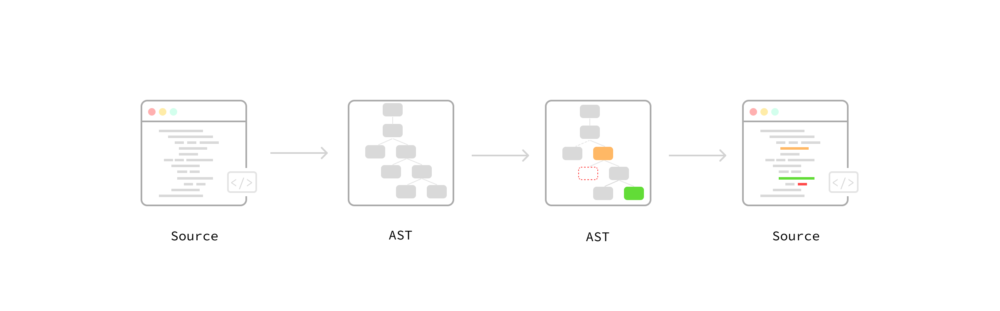
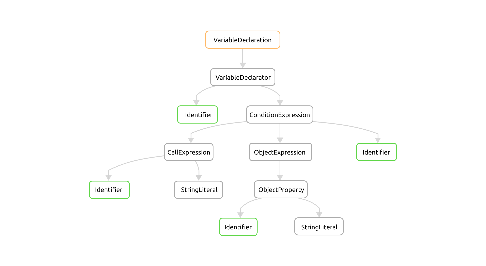
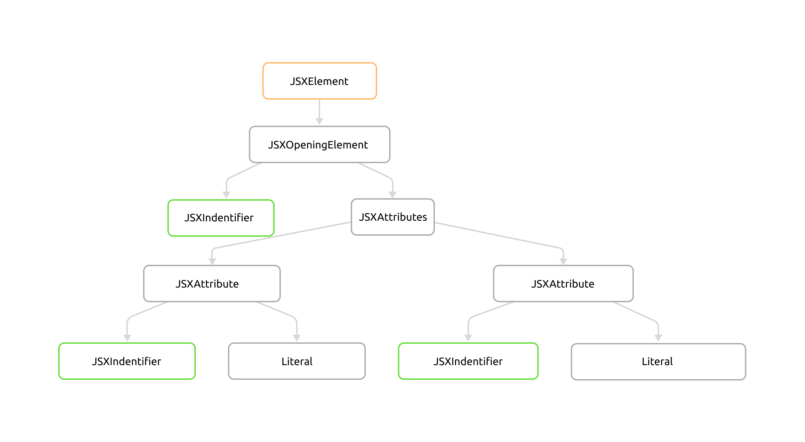
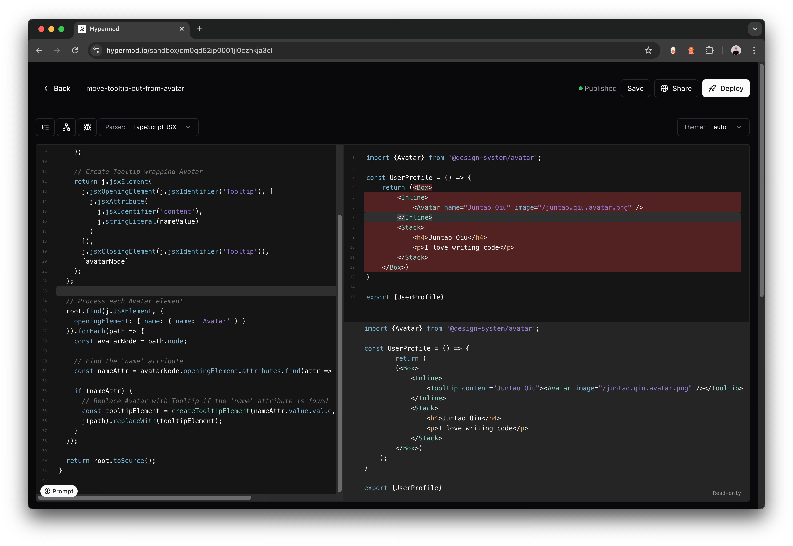
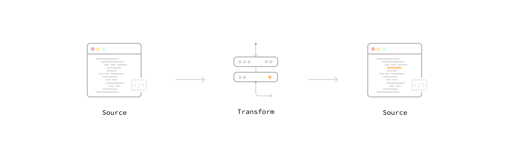
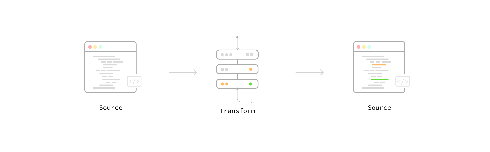

# Refactoring with Codemods to Automate API Changes

*Refactoring is something developers do all the time—making code easier to understand, maintain, and extend. While IDEs can handle simple refactorings with just a few keystrokes, things get tricky when you need to apply changes across large or distributed codebases, especially those you don’t fully control. That’s where codemods come in. By using Abstract Syntax Trees (AST), codemods allow you to automate large-scale code changes with precision and minimal effort, making them especially useful when dealing with breaking API changes. This article looks at how codemods can help manage these challenges, with practical examples like removing feature toggles or refactoring complex React components. We’ll also discuss potential pitfalls and how to avoid them when using codemods at scale.*

## Introduction

As a library developer, you may create a popular utility that hundreds of thousands of developers rely on daily, such as lodash or React. Over time, usage patterns might emerge that go beyond your initial design. When this happens, you may need to extend an API by adding parameters or modifying function signatures to fix edge cases. The challenge lies in rolling out these breaking changes without disrupting your users’ workflows.

This is where **codemods** come in—a powerful tool for automating large-scale code transformations, allowing developers to introduce breaking API changes, refactor legacy codebases, and maintain code hygiene with minimal manual effort.

In this article, we’ll explore what codemods are and the tools you can use to create them, such as **jscodeshift**, [**hypermod.io**](https://www.hypermod.io/), and [codemod.com](http://codemod.com/). We’ll walk through real-world examples, from cleaning up feature toggles to refactoring component hierarchies. You’ll also learn how to break down complex transformations into smaller, testable pieces—a practice known as codemod composition—to ensure flexibility and maintainability.

By the end, you’ll see how codemods can become a vital part of your toolkit for managing large-scale codebases, helping you keep your code clean and maintainable while handling even the most challenging refactoring tasks.

### Breaking Changes in APIs

Returning to the scenario of the library developer, after the initial release, new usage patterns emerge, prompting the need to extend an API—perhaps by adding a parameter or modifying a function signature to make it easier to use.

For simple changes, a basic find-and-replace in the IDE might work. In more complex cases, you might resort to using tools like `sed` or `awk`. However, when your library is widely adopted, the scope of such changes becomes harder to manage. You can’t be sure how extensively the modification will impact your users, and the last thing you want is to break existing functionality that doesn’t need updating.

A common approach is to announce the breaking change, release a new version, and ask users to migrate at their own pace. But this workflow, while familiar, often doesn't scale well, especially for major shifts. Consider React’s transition from class components to function components with hooks—a paradigm shift that took years for large codebases to fully adopt. By the time teams managed to migrate, more breaking changes were often already on the horizon.

For library developers, this situation creates a burden. Maintaining multiple older versions to support users who haven’t migrated is both costly and time-consuming. For users, frequent changes risk eroding trust. They may hesitate to upgrade or start exploring more stable alternatives, which perpetuating the cycle.

But what if you could help users manage these changes automatically? What if you could release a tool alongside your update that refactors their code for them—renaming functions, updating parameter order, and removing unused code without requiring manual intervention?

That’s where **codemods** come in. Several libraries, including React and Next.js, have already embraced codemods to smooth the path for version bumps. For example, React provides codemods to handle the migration from older API patterns, like the old Context API, to newer ones.

So, what exactly is the codemod we’re talking about here?

### What is a Codemod?

A codemod (code modification) is an automated script used to transform code to follow new APIs, syntax, or coding standards. Codemods use Abstract Syntax Tree (AST) manipulation to apply consistent, large-scale changes across codebases. Initially developed at Facebook, codemods helped engineers manage refactoring tasks for large projects like React. As Facebook scaled, maintaining the codebase and updating APIs became increasingly difficult, prompting the development of codemods.

Manually updating thousands of files across different repositories was inefficient and error-prone, so the concept of codemods—automated scripts that transform code—was introduced to tackle this problem.

The process typically involves three main steps:
1. **Parsing** the code into an AST, where each part of the code is represented as a tree structure.
2. **Modifying** the tree by applying a transformation, such as renaming a function or changing parameters.
3. **Rewriting** the modified tree back into the source code.

By using this approach, codemods ensure that changes are applied consistently across every file in a codebase, reducing the chance of human error. Codemods can also handle complex refactoring scenarios, such as changes to deeply nested structures or removing deprecated API usage.

If we visualize the process, it would look something like this:



The idea of a program that can “understand” your code and then perform automatic transformations isn’t new. That’s how your IDE works when you run refactorings like **Extract Function**, **Rename Variable**, or **Inline Function**. Essentially, your IDE parses the source code into ASTs and applies predefined transformations to the tree, saving the result back into your files.

For modern IDEs, many things happen under the hood to ensure changes are applied correctly and efficiently, such as determining the scope of the change and resolving conflicts like variable name collisions. Some refactorings even prompt you to input parameters, such as when using **Change Signature**, where you can adjust the order of parameters or default values before finalizing the change.

## Use jscodeshift in JavaScript Codebases

Let’s look at a concrete example to understand how we could run a codemod in a JavaScript project. The JavaScript community has several tools that make this work feasible, including parsers that convert source code into an AST, as well as transpilers that can transform the tree into other formats (this is how TypeScript works). Additionally, there are tools that help apply codemods to entire repositories automatically.

One of the most popular tools for writing codemods is **jscodeshift**, a toolkit maintained by Facebook. It simplifies the creation of codemods by providing a powerful API to manipulate ASTs. With jscodeshift, developers can search for specific patterns in the code and apply transformations at scale.

You can use `jscodeshift` to identify and replace deprecated API calls with updated versions across an entire project.

Let’s break down a typical workflow for composing a codemod manually.

### Clean a Stale Feature Toggle

Let’s start with a simple yet practical example to demonstrate the power of codemods. Imagine you’re using a [feature toggle](https://martinfowler.com/articles/feature-toggles.html) in your codebase to control the release of unfinished or experimental features. Once the feature is live in production and working as expected, the next logical step is to clean up the toggle and any related logic.

For instance, consider the following code:

```tsx
const data = featureToggle('feature-new-product-list') ? { name: 'Product' } : undefined;
```

Once the feature is fully released and no longer needs a toggle, this can be simplified to:

```tsx
const data = { name: 'Product' };
```

The task involves finding all instances of `featureToggle` in the codebase, checking whether the toggle refers to `feature-new-product-list`, and removing the conditional logic surrounding it. At the same time, other feature toggles (like `feature-search-result-refinement`, which may still be in development) should remain untouched. The codemod needs to *understand* the structure of the code to apply changes selectively.

### Understanding the AST

Before we dive into writing the codemod, let’s break down how this specific code snippet looks in an AST. You can use tools like [AST Explorer](https://astexplorer.net/) to visualize how source code and AST are mapped. It’s helpful to understand the node types you're interacting with before applying any changes.

The image below shows the syntax tree in terms of ECMAScript syntax. It contains nodes like `Identifier` (for variables), `StringLiteral` (for the toggle name), and more abstract nodes like `CallExpression` and `ConditionalExpression`.



In this AST representation, the variable `data` is assigned using a **ConditionalExpression**. The **test** part of the expression calls `featureToggle('feature-new-product-list')`. If the test returns `true`, the **consequent** branch assigns `{ name: 'Product' }` to `data`. If `false`, the **alternate** branch assigns `undefined`.

For a task with clear input and output, I prefer writing tests first, then implementing the codemod. I start by defining a negative case to ensure we don’t accidentally change things we want to leave untouched, followed by a real case that performs the actual conversion. I begin with a simple scenario, implement it, then add a variation (like checking if featureToggle is called inside an if statement), implement that case, and ensure all tests pass.

This approach aligns well with **Test-Driven Development (TDD)**, even if you don’t practice TDD regularly. Knowing exactly what the transformation's inputs and outputs are before coding improves safety and efficiency, especially when tweaking codemods.

With jscodeshift, you can write tests to verify how the codemod behaves:

```ts
const transform = require("../remove-feature-new-product-list");

defineInlineTest(
  transform,
  {},
  `
  const data = featureToggle('feature-new-product-list') ? { name: 'Product' } : undefined;
  `,
  `
  const data = { name: 'Product' };
  `,
  "delete the toggle feature-new-product-list in conditional operator"
);
```

The `defineInlineTest` function from jscodeshift allows you to define the input, expected output, and a string describing the test's intent. Now, running the test with a normal `jest` command will fail because the codemod isn’t written yet.

The corresponding negative case would ensure the code remains unchanged for other feature toggles:

```ts
defineInlineTest(
  transform,
  {},
  `
  const data = featureToggle('feature-search-result-refinement') ? { name: 'Product' } : undefined;
  `,
  `
  const data = featureToggle('feature-search-result-refinement') ? { name: 'Product' } : undefined;
  `,
  "do not change other feature toggles"
);
```

### Writing the Codemod

Let’s start by defining a simple *transform* function. Create a file called `transform.js` with the following code structure:

```tsx
module.exports = function(fileInfo, api, options) {
  const j = api.jscodeshift;
  const root = j(fileInfo.source);

  // manipulate the tree nodes here

  return root.toSource();
};
```

This function reads the file into a tree and uses jscodeshift’s API to query, modify, and update the nodes. Finally, it converts the AST back to source code with `.toSource()`.

Now we can start implementing the transform steps:

1. Find all instances of `featureToggle`.
2. Verify that the argument passed is `'feature-new-product-list'`.
3. Replace the entire conditional expression with the **consequent** part, effectively removing the toggle.

Here’s how we achieve this using `jscodeshift`:

```tsx
module.exports = function (fileInfo, api, options) {
  const j = api.jscodeshift;
  const root = j(fileInfo.source);

  // Find ConditionalExpression where the test is featureToggle('feature-new-product-list')
  root
    .find(j.ConditionalExpression, {
      test: {
        callee: { name: "featureToggle" },
        arguments: [{ value: "feature-new-product-list" }],
      },
    })
    .forEach((path) => {
      // Replace the ConditionalExpression with the 'consequent'
      j(path).replaceWith(path.node.consequent);
    });

  return root.toSource();
};
```

The codemod above:
- Finds `ConditionalExpression` nodes where the test calls `featureToggle('feature-new-product-list')`.
- Replaces the entire conditional expression with the **consequent** (i.e., `{ name: 'Product' }`), removing the toggle logic and leaving simplified code behind.

This example demonstrates how easy it is to create a useful transformation and apply it to a large codebase, significantly reducing manual effort.

You’ll need to write more test cases to handle variations like `if-else` statements, logical expressions (e.g., `!featureToggle('feature-new-product-list')`), and so on to make the codemod robust in real-world scenarios.

Once the codemod is ready, you can test it out on a target codebase, such as the one you're working on. jscodeshift provides a command-line tool that you can use to apply the codemod and report the results.

```bash
$ jscodeshift -t transform-name src/
```

After validating the results, check that all functional tests still pass and that nothing breaks—even if you're introducing a breaking change. Once satisfied, you can commit the changes and raise a pull request as part of your normal workflow.

### Codemods Improve Code Quality and Maintainability

Codemods aren’t just useful for managing breaking API changes—they can significantly improve code quality and maintainability. As codebases evolve, they often accumulate technical debt, including outdated feature toggles, deprecated methods, or tightly coupled components. Manually refactoring these areas can be time-consuming and error-prone.

By automating refactoring tasks, codemods help keep your codebase clean and free of legacy patterns. Regularly applying codemods allows you to enforce new coding standards, remove unused code, and modernize your codebase without having to manually modify every file.

### Refactoring an Avatar Component

Now, let’s look at a more complex example. Suppose you’re working with a design system that includes an `Avatar` component tightly coupled with a `Tooltip`. Whenever a user passes a `name` prop into the `Avatar`, it automatically wraps the avatar with a tooltip.

Here’s the current `Avatar` implementation:

```tsx
import { Tooltip } from "@design-system/tooltip";

const Avatar = ({ name, image }: AvatarProps) => {
  if (name) {
    return (
      <Tooltip content={name}>
        <CircleImage image={image} />
      </Tooltip>
    );
  }

  return <CircleImage image={image} />;
};
```

The goal is to decouple the `Tooltip` from the `Avatar` component, giving developers more flexibility. Developers should be able to decide whether to wrap the `Avatar` in a `Tooltip`. In the refactored version, `Avatar` will simply render the image, and users can apply a `Tooltip` manually if needed.

Here’s the refactored version of `Avatar`:

```tsx
const Avatar = ({ image }: AvatarProps) => {
  return <CircleImage image={image} />;
};
```

Now, users can manually wrap the `Avatar` with a `Tooltip` as needed:

```tsx
import { Tooltip } from "@design-system/tooltip";
import { Avatar } from "@design-system/avatar";

const UserProfile = () => {
  return (
    <Tooltip content="Juntao Qiu">
      <Avatar image="/juntao.qiu.avatar.png" />
    </Tooltip>
  );
};
```

The challenge arises when there are hundreds of Avatar usages spread across the codebase. Manually refactoring each instance would be highly inefficient, so we can use a codemod to automate this process.

Using tools like [AST Explorer](https://astexplorer.net/), we can inspect the component and see which nodes represent the `Avatar` usage we’re targeting. The above JSX code is parsed into an abstract syntax tree that looks like this:



With the details of the code filled into the abstract tree, it looks like this:


### Writing the Codemod

Let’s break down the transformation into smaller tasks:
- Find `Avatar` usage in the component tree.
- Check if the `name` prop is present.
  - If not, do nothing.
  - If present:
    - Create a `Tooltip` node.
    - Add the `name` to the `Tooltip`.
    - Remove the `name` from `Avatar`.
    - Add `Avatar` as a child of the `Tooltip`.
    - Replace the original `Avatar` node with the new `Tooltip`.

To begin, we’ll find all instances of Avatar (I’ll omit some of the tests, but you should write comparison tests first). 

```tsx
defineInlineTest(
    { default: transform, parser: "tsx" },
    {},
    `
    <Avatar name="Juntao Qiu" image="/juntao.qiu.avatar.png" />
    `,
    `
    <Tooltip content="Juntao Qiu">
      <Avatar image="/juntao.qiu.avatar.png" />
    </Tooltip>
    `,
    "wrap avatar with tooltip when name is provided"
  );
```

Similar to the `featureToggle` example, we can use `root.find` with search criteria to locate all Avatar nodes:

```tsx
root
  .find(j.JSXElement, {
    openingElement: { name: { name: "Avatar" } },
  })
  .forEach((path) => {
    // now we can handle each Avatar instance
  });
```

Next, we check if the `name` prop is present:

```tsx
root
  .find(j.JSXElement, {
    openingElement: { name: { name: "Avatar" } },
  })
  .forEach((path) => {
    const avatarNode = path.node;

    const nameAttr = avatarNode.openingElement.attributes.find(
      (attr) => attr.name.name === "name"
    );

    if (nameAttr) {
      const tooltipElement = createTooltipElement(
        nameAttr.value.value,
        avatarNode
      );
      j(path).replaceWith(tooltipElement);
    }
  });
```

For the `createTooltipElement` function, we use the jscodeshift API to create a new JSX node, with the `name` prop applied to the `Tooltip` and the `Avatar` component as a child. Finally, we call `replaceWith` to replace the current `path`.

Here’s a preview of how it looks in [Hypermod](https://www.hypermod.io/), where the codemod is written on the left. The top part on the right is the original code, and the bottom part is the transformed result:



This codemod searches for all instances of `Avatar`. If a `name` prop is found, it removes the `name` prop from `Avatar`, wraps the `Avatar` inside a `Tooltip`, and passes the `name` prop to the `Tooltip`.

By now, I hope it’s clear that codemods are incredibly useful and that the workflow is intuitive, especially for large-scale changes where manual updates would be a huge burden. However, that's not the whole picture. In the next section, I’ll shed light on some of the challenges and how we can address these less-than-ideal aspects.

## Common Pitfalls of Codemods

As a seasoned developer, you know the "happy path" is only a small part of the full picture. There are numerous scenarios to consider when writing a transformation script to handle code automatically.

Developers write code in a variety of styles. For example, someone might import the `Avatar` component but give it a different name because they might have another `Avatar` component from a different package:

```tsx
import { Avatar as AKAvatar } from "@design-system/avatar";

const UserInfo = () => (
  <AKAvatar name="Juntao Qiu" image="/juntao.qiu.avatar.png" />
);
```

A simple text search for `Avatar` won’t work in this case. You’ll need to detect the alias and apply the transformation using the correct name.

Another example arises when dealing with `Tooltip` imports. If the file already imports `Tooltip` but uses an alias, the codemod must detect that alias and apply the changes accordingly. You can't assume that the component named `Tooltip` is always the one you’re looking for.

In the **feature toggle** example, someone might use `if(featureToggle('feature-new-product-list'))`, or assign the result of the toggle function to a variable before using it:

```tsx
const shouldEnableNewFeature = featureToggle('feature-new-product-list');

if (shouldEnableNewFeature) {
  //...
}
```

They might even use the toggle with other conditions or apply logical negation, making the logic more complex:

```tsx
const shouldEnableNewFeature = featureToggle('feature-new-product-list');

if (!shouldEnableNewFeature && someOtherLogic) {
  //...
}
```

These variations make it difficult to foresee every edge case, increasing the risk of unintentionally breaking something. Relying solely on the cases you can anticipate is not enough. You need thorough testing to avoid breaking unintended parts of the code.

### Leveraging Source Graphs and Test-Driven Codemods

To handle these complexities, codemods should be used alongside other techniques. For instance, a few years ago, I participated in a design system components rewrite project at Atlassian. We addressed this issue by first searching the source graph, which contained the majority of internal component usage. This allowed us to understand how components were used, whether they were imported under different names, or whether certain public props were frequently used. After this search phase, we wrote our test cases upfront, ensuring we covered the majority of use cases, and then developed the codemod.

In situations where we couldn't confidently automate the upgrade, we inserted comments or "TODOs" at the call sites. This allowed the developers running the script to handle specific cases manually. Usually, there were only a handful of such instances, so this approach still proved beneficial for upgrading versions.

### Utilizing Existing Code Standardization Tools

As you can see, there are plenty of edge cases to handle, especially in codebases beyond your control—such as external dependencies. This complexity means that using codemods requires careful supervision and a review of the results.

However, if your codebase has standardization tools in place, such as a linter that enforces a particular coding style, you can leverage these tools to reduce edge cases. By enforcing a consistent structure, tools like linters help narrow down the variations in code, making the transformation easier and minimizing unexpected issues. 

For instance, you could use linting rules to restrict certain patterns, such as avoiding nested conditional (ternary) operators or enforcing named exports over default exports. These rules help streamline the codebase, making codemods more predictable and effective.

Additionally, breaking down complex transformations into smaller, more manageable ones allows you to tackle individual issues more precisely. As we'll soon see, composing smaller codemods can make handling complex changes more feasible.

### Extracting Reusable Utilities

Even with a well-thought-out strategy, some repetitive tasks persist, such as adding an import if it's missing, inserting comments at specific locations, or renaming props. These types of operations often recur in different transformations.

Over time, we’ve developed a set of helper functions that streamline codemod development. These utilities allow us to automate common tasks more efficiently. A good example is how we compose these smaller utilities into larger, more complex transformers, which I’ll cover in the next section.

### Codemod Composition

Let’s revisit the feature toggle removal example discussed earlier:

```tsx
import { featureToggle } from "./utils/featureToggle";

const convertOld = (input: string) => {
  return input.toLowerCase();
};

const convertNew = (input: string) => {
  return input.toUpperCase();
};

const result = featureToggle("feature-convert-new")
  ? convertNew("Hello, world")
  : convertOld("Hello, world");

console.log(result);
```

After running the codemod, we want the result to look like this:

```tsx
const convertNew = (input: string) => {
  return input.toUpperCase();
};

const result = convertNew("Hello, world");

console.log(result);
```

Beyond removing the feature toggle logic, there are additional tasks to handle:
- Remove the unused `convertOld` function.
- Clean up the unused `featureToggle` import.

Of course, you could write one big codemod to handle everything in a single pass and test it together. However, a more maintainable approach is to treat codemod logic like product code: break the task into smaller, independent pieces—just like how you would normally refactor production code.

### Breaking It Down

We can break the big transformation down into smaller codemods and compose them. The advantage of this approach is that each transformation can be tested individually, covering different cases without interference. Moreover, it allows you to reuse and compose them for different purposes.

For instance, you might break it down like this:
- A transformation to remove a specific feature toggle.
- Another transformation to clean up unused imports.
- A transformation to remove unused function declarations.

By composing these, you can create a pipeline of transformations:

```tsx
import { removeFeatureToggle } from "./remove-feature-toggle";
import { removeUnusedImport } from "./remove-unused-import";
import { removeUnusedFunction } from "./remove-unused-function";

import { createTransformer } from "./utils";

const removeFeatureNewProductList = removeFeatureToggle("feature-new-product-list");

const transform = createTransformer([
  removeFeatureNewProductList,
  removeUnusedImport,
  removeUnusedFunction,
]);

export default transform;
```

In this pipeline, the transformations work as follows:
1. Remove the `feature-new-product-list` toggle.
2. Clean up the unused `import` statement.
3. Remove the `convertOld` function since it’s no longer used.



You can also extract additional codemods as needed, combining them in various orders depending on the desired outcome.



### The `createTransformer` Function

The implementation of the `createTransformer` function is relatively straightforward. It acts as a higher-order function that takes a list of smaller transform functions, iterates through the list to apply them to the root AST, and finally converts the modified AST back into source code.

```tsx
import { API, Collection, FileInfo, JSCodeshift, Options } from "jscodeshift";

type TransformFunction = { (j: JSCodeshift, root: Collection): void };

const createTransformer =
  (transforms: TransformFunction[]) =>
  (fileInfo: FileInfo, api: API, options: Options) => {
    const j = api.jscodeshift;
    const root = j(fileInfo.source);

    transforms.forEach((transform) => transform(j, root));
    return root.toSource(options.printOptions || { quote: "single" });
  };

export { createTransformer };
```

For example, you could have a transform function that inlines expressions assigning the feature toggle call to a variable, so in later transforms you don’t have to worry about those cases anymore:

```tsx
const shouldEnableNewFeature = featureToggle('feature-new-product-list');

if (!shouldEnableNewFeature && someOtherLogic) {
  //...
}
```

Becomes this:

```tsx
if (!featureToggle('feature-new-product-list') && someOtherLogic) {
  //...
}
```

Over time, you might build up a collection of reusable, smaller transforms, which can greatly ease the process of handling tricky edge cases. This approach proved highly effective in our work refining design system components. Once we converted one package—such as the button component—we had a few reusable transforms defined, like adding comments at the start of functions, removing deprecated props, or creating aliases when a package is already imported above.

Each of these smaller transforms can be tested and used independently or combined for more complex transformations, which speeds up subsequent conversions significantly. As a result, our refinement work became more efficient, and these generic codemods are now applicable to other internal and even external React codebases.

Since each transform is relatively standalone, you can fine-tune them without affecting other transforms or the more complex, composed ones. For instance, you might re-implement a transform to improve performance—like reducing the number of node-finding rounds—and with comprehensive test coverage, you can do this confidently and safely.

## Codemods in Other Languages

While the examples we’ve explored so far focus on JavaScript and JSX using **jscodeshift**, codemods can also be applied to other languages. For instance, **JavaParser** ([https://javaparser.org/](https://javaparser.org/)) offers a similar mechanism in Java, using AST manipulation to refactor Java code.

### Using JavaParser in a Java Codebase

JavaParser can be useful for making breaking API changes or refactoring large Java codebases in a structured, automated way.

Assume we have the following code in `FeatureToggleExample.java`, which checks the toggle `feature-new-product-list` and branches accordingly:

```java
public class FeatureToggleExample {
    public void execute() {
        if (FeatureToggle.isEnabled("feature-new-product-list")) {
          newFeature();
        } else {
          oldFeature();
        }
    }
    
    void newFeature() {
        System.out.println("New Feature Enabled");
    }
    
    void oldFeature() {
        System.out.println("Old Feature");
    }
}
```

We can define a visitor to find `if` statements checking for `FeatureToggle.isEnabled`, and then replace them with the corresponding true branch—similar to how we handled the feature toggle codemod in JavaScript.

```java
// Visitor to remove feature toggles
class FeatureToggleVisitor extends VoidVisitorAdapter<Void> {
    @Override
    public void visit(IfStmt ifStmt, Void arg) {
        super.visit(ifStmt, arg);
        if (ifStmt.getCondition().isMethodCallExpr()) {
            MethodCallExpr methodCall = ifStmt.getCondition().asMethodCallExpr();
            if (methodCall.getNameAsString().equals("isEnabled") &&
                methodCall.getScope().isPresent() &&
                methodCall.getScope().get().toString().equals("FeatureToggle")) {

                BlockStmt thenBlock = ifStmt.getThenStmt().asBlockStmt();
                ifStmt.replace(thenBlock);
            }
        }
    }
}
```

This code defines a **visitor** pattern using JavaParser to traverse and manipulate the AST. The `FeatureToggleVisitor` looks for `if` statements that call `FeatureToggle.isEnabled()` and replaces the entire `if` statement with the true branch.

You can also define visitors to find unused methods and remove them:

```java
class UnusedMethodRemover extends VoidVisitorAdapter<Void> {
    private Set<String> calledMethods = new HashSet<>();
    private List<MethodDeclaration> methodsToRemove = new ArrayList<>();

    // Collect all called methods
    @Override
    public void visit(MethodCallExpr n, Void arg) {
        super.visit(n, arg);
        calledMethods.add(n.getNameAsString());
    }

    // Collect methods to remove if not called
    @Override
    public void visit(MethodDeclaration n, Void arg) {
        super.visit(n, arg);
        String methodName = n.getNameAsString();
        if (!calledMethods.contains(methodName) && !methodName.equals("main")) {
            methodsToRemove.add(n);
        }
    }

    // After visiting, remove the unused methods
    public void removeUnusedMethods() {
        for (MethodDeclaration method : methodsToRemove) {
            method.remove();
        }
    }
}
```

This code defines a visitor, `UnusedMethodRemover`, to detect and remove unused methods. It tracks all called methods in the `calledMethods` set and checks each method declaration. If a method isn’t called and isn’t `main`, it adds it to the list of methods to remove. Once all methods are processed, it removes any unused methods from the AST.

### Composing Java Visitors

You can chain these visitors together and apply them to your codebase like so:

```java
public class FeatureToggleRemoverWithCleanup {
    public static void main(String[] args) {
        try {
            String filePath = "src/test/java/com/example/Example.java";
            CompilationUnit cu = StaticJavaParser.parse(new FileInputStream(filePath));
            
            // Apply transformations
            FeatureToggleVisitor toggleVisitor = new FeatureToggleVisitor();
            cu.accept(toggleVisitor, null);
            
            UnusedMethodRemover remover = new UnusedMethodRemover();
            cu.accept(remover, null);
            remover.removeUnusedMethods();

            // Write the modified code back to the file
            try (FileOutputStream fos = new FileOutputStream(filePath)) {
                fos.write(cu.toString().getBytes());
            }

            System.out.println("Code transformation completed successfully.");
        } catch (IOException e) {
            e.printStackTrace();
        }
    }
}
```

Each visitor is a unit of transformation, and the visitor pattern in JavaParser makes it easy to compose them.

## OpenRewrite

Another popular option for Java projects is **OpenRewrite**. It uses a different format of the source code tree called **Lossless Semantic Trees (LSTs)**, which provide more detailed information compared to traditional AST (Abstract Syntax Tree) approaches used by tools like JavaParser or jscodeshift. While AST focuses on the syntactic structure, LSTs capture both syntax and semantic meaning, enabling more accurate and sophisticated transformations.

OpenRewrite also has a robust ecosystem of open-source refactoring recipes for tasks such as framework migrations, security fixes, and maintaining stylistic consistency. This built-in library of recipes can save developers significant time by allowing them to apply standardized transformations across large codebases without needing to write custom scripts.

For developers who need customized transformations, OpenRewrite allows you to create and distribute your own recipes, making it a highly flexible and extensible tool. It’s widely used in the Java community and is gradually expanding into other languages, thanks to its advanced capabilities and community-driven approach.

### Differences Between OpenRewrite and JavaParser or jscodeshift

The key difference between **OpenRewrite** and tools like **JavaParser** or **jscodeshift** lies in their approach to code transformation:
- **OpenRewrite**’s **Lossless Semantic Trees (LSTs)** capture both the syntactic and semantic meaning of the code, enabling more accurate transformations.
- **JavaParser** and **jscodeshift** rely on traditional **ASTs**, which focus primarily on the syntactic structure. While powerful, they may not always capture the nuances of how the code behaves semantically.
  
Additionally, OpenRewrite offers a large library of community-driven refactoring recipes, making it easier to apply common transformations without needing to write custom codemods from scratch.

## Other Tools for Codemods

While **jscodeshift** and **OpenRewrite** are powerful tools, there are other options worth considering, depending on your needs and the ecosystem you're working in.

### Hypermod

**Hypermod** introduces AI assistance to the codemod writing process. Instead of manually crafting the codemod logic, developers can describe the desired transformation in plain English, and Hypermod will generate the codemod using `jscodeshift`. This makes codemod creation more accessible, even for developers who may not be familiar with AST manipulation.

You can compose, test, and deploy a codemod to any repository connected to Hypermod. It can run the codemod and generate a pull request with the proposed changes, allowing you to review and approve them. This integration makes the entire process from codemod development to deployment much more streamlined.

### Codemod.com

[**Codemod.com**](http://codemod.com/) is a community-driven platform where developers can share and discover codemods. If you need a specific codemod for a common refactoring task or migration, you can search for existing codemods. Alternatively, you can publish codemods you’ve created to help others in the developer community.

If you're migrating an API and need a codemod to handle it, **Codemod.com** can save you time by offering pre-built codemods for many common transformations, reducing the need to write one from scratch.

## Conclusion

Codemods are powerful tools that allow developers to automate code transformations, making it easier to manage API changes, refactor legacy code, and maintain consistency across large codebases with minimal manual intervention. By using tools like **jscodeshift**, **Hypermod**, or **OpenRewrite**, developers can streamline everything from minor syntax changes to major component rewrites, improving overall code quality and maintainability.

However, while codemods offer significant benefits, they are not without challenges. One of the key concerns is handling edge cases, particularly when the codebase is diverse or publicly shared. Variations in coding styles, import aliases, or unexpected patterns can lead to issues that codemods may not handle automatically. These edge cases require careful planning, thorough testing, and, in some instances, manual intervention to ensure accuracy.

To maximize the effectiveness of codemods, it’s crucial to break complex transformations into smaller, testable steps and to use code standardization tools where possible. Codemods can be highly effective, but their success depends on thoughtful design and understanding the limitations they may face in more varied or complex codebases.